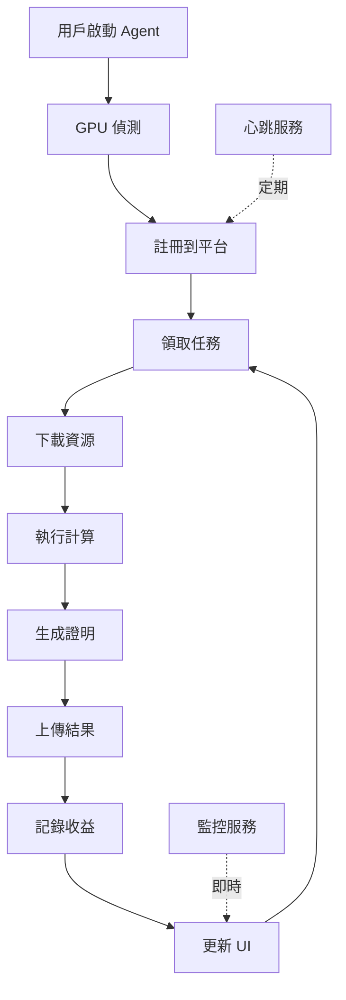

# Orban Agent - 設計文檔

> 從第一性原理出發的分散式 GPU 算力貢獻系統

## 目錄

- [核心設計哲學](#核心設計哲學)
- [系統架構](#系統架構)
- [技術選型](#技術選型)
- [關鍵組件](#關鍵組件)
- [安全性設計](#安全性設計)
- [開源策略](#開源策略)
- [部署方案](#部署方案)

---

## 核心設計哲學

### 第一性原理思考

#### 問題本質

**閒置 GPU + 計算需求 = 資源錯配**

- **供給端**：大量個人/企業擁有閒置 GPU
- **需求端**：AI 訓練/推論需要 GPU 算力
- **中介**：需要可信任的平台撮合供需

#### 最小必要功能

從第一性原理分解，Agent 必須做到：

1. **發現資源** → GPU 偵測與監控
2. **建立連接** → 與平台安全通訊
3. **執行任務** → 在隔離環境中運算
4. **證明工作** → 可驗證的計算證明
5. **追蹤收益** → 透明的獎勵系統

#### 設計原則

```
原則                    理由
━━━━━━━━━━━━━━━━━━━━━━━━━━━━━━━━━━━━━━━━━━━━━━━━━━━
安全第一                保護使用者的系統和隱私
可驗證性                防止作弊，建立信任
跨平台                  最大化參與者數量
模塊化                  每個組件可獨立測試和替換
效能優化                最小化 GPU 閒置時間
使用者友善              降低參與門檻
透明度                  開源核心，建立信任
```

---

## 系統架構

### 分層架構

```
┌─────────────────────────────────────────────────────┐
│  Layer 5: Application Layer                         │
│  ┌───────────┬──────────────┬──────────────────┐    │
│  │ Tauri UI  │  CLI Tool    │  System Tray     │    │
│  └───────────┴──────────────┴──────────────────┘    │
├─────────────────────────────────────────────────────┤
│  Layer 4: Business Logic Layer                      │
│  ┌───────────┬──────────────┬──────────────────┐    │
│  │ Earnings  │  Scheduler   │  Config Manager  │    │
│  └───────────┴──────────────┴──────────────────┘    │
├─────────────────────────────────────────────────────┤
│  Layer 3: Core Services Layer                       │
│  ┌───────────┬──────────────┬──────────────────┐    │
│  │ GPU       │  Task        │  Network         │    │
│  │ Monitor   │  Executor    │  Client          │    │
│  └───────────┴──────────────┴──────────────────┘    │
├─────────────────────────────────────────────────────┤
│  Layer 2: Hardware Abstraction Layer                │
│  ┌───────────┬──────────────┬──────────────────┐    │
│  │ NVIDIA    │  AMD         │  Apple           │    │
│  │ CUDA      │  ROCm        │  Metal           │    │
│  └───────────┴──────────────┴──────────────────┘    │
├─────────────────────────────────────────────────────┤
│  Layer 1: Runtime Layer                             │
│  ┌───────────┬──────────────┬──────────────────┐    │
│  │ Docker    │  Podman      │  Native          │    │
│  └───────────┴──────────────┴──────────────────┘    │
├─────────────────────────────────────────────────────┤
│  Layer 0: Operating System                          │
│  │  Linux    │  Windows     │  macOS           │    │
│  └───────────┴──────────────┴──────────────────┘    │
└─────────────────────────────────────────────────────┘
```

### 資料流



---

## 技術選型

### 語言選擇：Rust

**為什麼選擇 Rust？**

| 需求 | 選擇理由 |
|------|---------|
| GPU 操作 | 優秀的 C/C++ FFI，可直接呼叫 CUDA/ROCm |
| 記憶體安全 | 編譯期檢查，防止記憶體洩漏 |
| 效能 | 零成本抽象，接近 C++ 效能 |
| 併發 | 安全的併發模型（所有權系統） |
| 跨平台 | 一次編寫，處處編譯 |
| 生態系統 | Cargo 包管理，豐富的 crates |

**與其他語言比較：**

```
語言         GPU 支援    效能    安全性    開發效率    結論
━━━━━━━━━━━━━━━━━━━━━━━━━━━━━━━━━━━━━━━━━━━━━━━━━━━━━━━
C++         ⭐⭐⭐⭐⭐   ⭐⭐⭐⭐⭐   ⭐⭐      ⭐⭐        高效但不安全
Rust        ⭐⭐⭐⭐⭐   ⭐⭐⭐⭐⭐   ⭐⭐⭐⭐⭐   ⭐⭐⭐      ✅ 最佳選擇
Go          ⭐⭐⭐      ⭐⭐⭐⭐    ⭐⭐⭐⭐    ⭐⭐⭐⭐⭐    GPU 支援不足
Python      ⭐⭐⭐⭐⭐   ⭐⭐       ⭐⭐⭐     ⭐⭐⭐⭐⭐    效能不足
```

### UI 框架：Tauri + React

**為什麼選擇 Tauri？**

```
Tauri vs Electron

指標              Tauri          Electron
━━━━━━━━━━━━━━━━━━━━━━━━━━━━━━━━━━━━━━━━━━
包體積            5-10 MB        150+ MB
記憶體使用        ~50 MB         ~150 MB
啟動時間          < 1s           2-3s
原生整合          ✅ 優秀         ⚠️ 有限
安全性            ✅ 沙盒隔離     ⚠️ 需額外配置
跨平台            ✅             ✅
```

### 通訊協議

```
HTTP/REST         任務領取、結果提交
WebSocket         即時通訊、心跳
Protocol Buffers  二進制序列化（高效）
JSON              調試和配置（可讀）
TLS 1.3           加密通訊
mTLS              雙向認證
```

---

## 關鍵組件

### 1. GPU 抽象層

**目的**：統一不同廠商 GPU 的接口

```rust
pub trait GPUDevice: Send + Sync {
    fn name(&self) -> String;
    fn total_memory_gb(&self) -> f32;
    fn utilization(&self) -> Result<f32>;
    fn temperature(&self) -> Result<f32>;
    // ...更多方法
}
```

**支援的 GPU**：

- ✅ NVIDIA (CUDA) - 通過 NVML
- ✅ AMD (ROCm) - 通過 ROCm SMI
- ✅ Apple (Metal) - 通過 Metal 框架
- 🔄 Intel (oneAPI) - 計劃中

### 2. 任務執行引擎

**執行流程**：

```
1. 資源準備
   ├─ 下載模型 (支援斷點續傳)
   ├─ 下載資料集
   └─ 驗證校驗和

2. 環境隔離
   ├─ Docker 容器 (優先)
   ├─ Podman (備選)
   └─ Native (測試)

3. GPU 計算
   ├─ 載入模型到 VRAM
   ├─ 執行推論/訓練
   └─ 監控資源使用

4. 結果驗證
   ├─ 生成工作證明 (PoGW)
   ├─ 計算結果哈希
   └─ GPU 硬體簽名

5. 資源清理
   ├─ 釋放 GPU 記憶體
   ├─ 刪除臨時檔案
   └─ 停止容器
```

### 3. 工作證明機制

**PoGW (Proof of GPU Work)**：

```rust
pub struct ProofOfWork {
    challenge: String,      // 平台提供的挑戰值
    response: String,       // GPU 計算的回應
    gpu_signature: String,  // 硬體簽名
    timestamp: DateTime,    // 防重放
    metadata: Value,        // 額外驗證資料
}
```

**驗證策略**：

1. **GPU 密集型計算**：只能用 GPU 高效完成的哈希
2. **硬體指紋**：GPU UUID + 型號綁定
3. **時間戳**：防止重放攻擊
4. **結果哈希**：綁定計算結果

### 4. 收益系統

**費率計算**：

```rust
基礎費率 = $0.01 / GPU Hour

GPU 型號倍數：
- H100: 8.0x  → $0.08/hour
- A100: 5.0x  → $0.05/hour
- 4090: 2.5x  → $0.025/hour
- 3090: 1.8x  → $0.018/hour
- 其他: 1.0x  → $0.01/hour
```

**收益狀態**：

```
Pending   → 任務完成，待平台確認
Confirmed → 平台確認，待支付
Paid      → 已支付到錢包
```

---

## 安全性設計

### 多層防護

```
┌─────────────────────────────────────┐
│  Layer 5: 資料層                     │
│  - 模型加密傳輸                       │
│  - 本地加密儲存                       │
│  - 差分隱私保護                       │
├─────────────────────────────────────┤
│  Layer 4: 驗證層                     │
│  - Proof of GPU Work                │
│  - 統計異常檢測                       │
│  - ML 反欺詐模型                      │
├─────────────────────────────────────┤
│  Layer 3: 執行層                     │
│  - 容器沙盒 (Docker/Podman)          │
│  - 資源限制 (cgroups/namespace)      │
│  - 禁止網路外連                       │
├─────────────────────────────────────┤
│  Layer 2: 網路層                     │
│  - TLS 1.3 加密                      │
│  - mTLS 雙向認證                     │
│  - 證書固定 (Certificate Pinning)    │
├─────────────────────────────────────┤
│  Layer 1: 系統層                     │
│  - 最小權限原則                       │
│  - SELinux/AppArmor                 │
│  - 防火牆規則                         │
└─────────────────────────────────────┘
```

### 威脅模型與對策

| 威脅 | 對策 |
|------|------|
| 偽造 GPU 指標 | PoGW + 硬體簽名 + 冗餘驗證 |
| Sybil Attack | 硬體指紋 + Stake 機制 + 漸進式信任 |
| 惡意任務代碼 | 容器隔離 + 資源限制 + 網路封鎖 |
| 中間人攻擊 | mTLS + 證書固定 |
| 模型竊取 | 加密傳輸 + 臨時儲存 + 自動清理 |

---

## 開源策略

### 混合開源模式

#### ✅ 開源部分 (MIT License)

```
agent-core/
├── gpu/              # GPU 偵測與監控
├── compute/          # 任務執行引擎
│   ├── executor.rs   # ✅ 開源
│   ├── sandbox.rs    # ✅ 開源
│   └── verifier.rs   # ✅ 基礎版開源
├── network/          # 通訊協議
├── earnings/         # 收益追蹤
└── config/           # 配置管理
```

#### ❌ 閉源/專有部分

```
platform/
├── scheduler/        # 進階調度演算法
├── optimizer/        # FedAvg 權重聚合優化
├── security/         # ML 反欺詐模型
└── enterprise/       # 企業級功能
```

### 開源優勢

1. **信任**：代碼透明，社群審查
2. **速度**：更快的 bug 修復和功能迭代
3. **生態**：吸引開發者貢獻
4. **競爭**：保護核心演算法優勢

---

## 部署方案

### 一鍵安裝

#### Linux / macOS

```bash
curl -fsSL https://get.orban.ai/agent | sh
```

**腳本功能**：

1. 偵測作業系統和架構
2. 檢查 GPU 和驅動
3. 下載對應的二進制文件
4. 設定 systemd 服務（可選）
5. 配置自動啟動

#### Windows

```powershell
irm https://get.orban.ai/agent.ps1 | iex
```

### Docker 部署

```bash
docker run -d \
  --gpus all \
  -v ~/.orban-agent:/data \
  orban/agent:latest
```

### 系統需求

**最低需求**：

```
CPU:      2 核心
RAM:      4 GB
磁碟:     20 GB 可用空間
GPU:      NVIDIA/AMD/Apple (1GB+ VRAM)
網路:     10 Mbps+
```

**建議配置**：

```
CPU:      4+ 核心
RAM:      16 GB+
磁碟:     100 GB SSD
GPU:      NVIDIA RTX 3060+ / AMD RX 6700+
網路:     100 Mbps+
```

---

## 總結

Orban Agent 從第一性原理出發，設計了一個：

✅ **安全**：多層防護，沙盒隔離
✅ **可驗證**：PoGW 機制，防止作弊
✅ **跨平台**：支援 Windows/Linux/macOS
✅ **高效**：Rust 實現，零成本抽象
✅ **友善**：一鍵安裝，視覺化介面
✅ **透明**：核心開源，建立信任

的分散式 GPU 算力貢獻系統。

---

**下一步**：

1. 完成 Tauri 桌面應用
2. 實作完整的推論/訓練引擎
3. 部署測試網路
4. 社群測試和反饋
5. 主網啟動

