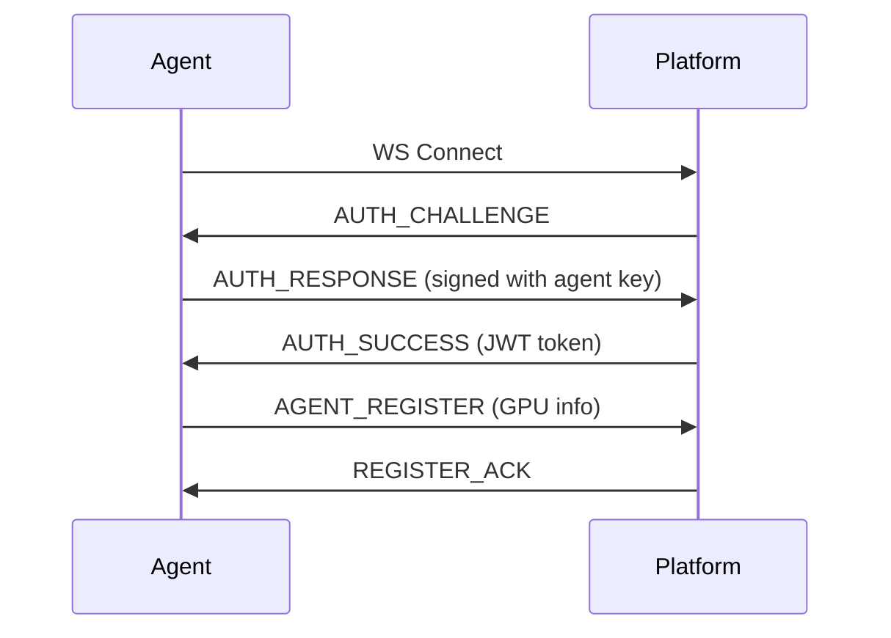
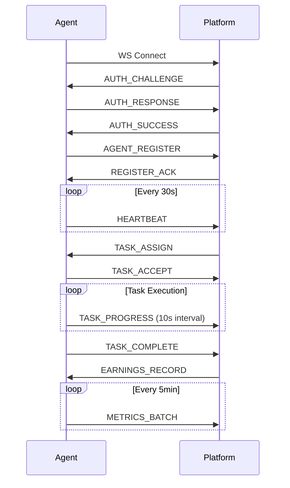

# Orban Protocol v1.0

## 概述

Orban Protocol 是 Orban Agent (供給端) 與 Orban Platform (需求端) 之間的通訊協議。

### 設計原則

1. **雙向通訊**: WebSocket 持久連線，支援即時任務分配
2. **安全第一**: TLS 加密 + JWT 身份驗證 + 工作證明
3. **容錯機制**: 斷線重連、訊息確認、冪等性設計
4. **效能優化**: Protocol Buffers 二進制序列化

---

## 1. 連線建立

### 1.1 WebSocket 連線

```
ws://platform.orban.ai/agent/v1/connect
wss://platform.orban.ai/agent/v1/connect  (生產環境)
```

### 1.2 認證流程



#### 訊息格式

**AUTH_CHALLENGE**
```json
{
  "type": "AUTH_CHALLENGE",
  "challenge": "random_nonce_base64",
  "timestamp": 1699999999
}
```

**AUTH_RESPONSE**
```json
{
  "type": "AUTH_RESPONSE",
  "agent_id": "agent-tw-a1b2c3d4",
  "signature": "ed25519_signature_base64",
  "public_key": "ed25519_pubkey_base64"
}
```

**AUTH_SUCCESS**
```json
{
  "type": "AUTH_SUCCESS",
  "jwt_token": "eyJhbGci...",
  "expires_in": 86400
}
```

---

## 2. Agent 註冊

### 2.1 註冊訊息

```json
{
  "type": "AGENT_REGISTER",
  "agent_id": "agent-tw-a1b2c3d4",
  "hardware": {
    "gpus": [
      {
        "index": 0,
        "vendor": "NVIDIA",
        "model": "GeForce RTX 4090",
        "vram_gb": 24,
        "compute_capability": "8.9",
        "cuda_cores": 16384,
        "pcie_bandwidth_gbps": 64
      }
    ],
    "cpu": {
      "model": "AMD Ryzen 9 7950X",
      "cores": 16,
      "threads": 32
    },
    "memory_gb": 64,
    "storage_available_gb": 500
  },
  "capabilities": {
    "supported_frameworks": ["pytorch", "tensorflow", "onnx"],
    "max_batch_size": 32,
    "fp16_support": true,
    "int8_support": true
  },
  "location": {
    "country": "TW",
    "region": "asia-east1",
    "latency_to_platform_ms": 12
  },
  "availability": {
    "hours_per_day": 24,
    "reliability_score": 0.98
  }
}
```

### 2.2 註冊確認

```json
{
  "type": "REGISTER_ACK",
  "agent_id": "agent-tw-a1b2c3d4",
  "status": "active",
  "pricing": {
    "base_rate_usd_per_hour": 0.50,
    "gpu_multiplier": 2.5,
    "effective_rate": 1.25
  }
}
```

---

## 3. 任務分配

### 3.1 任務推送 (Platform → Agent)

```json
{
  "type": "TASK_ASSIGN",
  "task_id": "task-2024-001",
  "job_id": "job-inference-abc123",
  "priority": 1,
  "estimated_duration_sec": 300,
  "requirements": {
    "min_vram_gb": 12,
    "min_compute_capability": "7.5",
    "framework": "pytorch",
    "fp16": true
  },
  "payload": {
    "model_url": "s3://orban-models/llama-7b.bin",
    "model_hash": "sha256:abcd1234...",
    "input_data_url": "s3://orban-jobs/job-abc123/input.json",
    "output_url": "s3://orban-jobs/job-abc123/output/",
    "config": {
      "max_tokens": 512,
      "temperature": 0.7
    }
  },
  "pricing": {
    "rate_usd_per_hour": 1.25,
    "estimated_payout": 0.104
  }
}
```

### 3.2 任務接受 (Agent → Platform)

```json
{
  "type": "TASK_ACCEPT",
  "task_id": "task-2024-001",
  "agent_id": "agent-tw-a1b2c3d4",
  "gpu_allocated": 0,
  "estimated_completion": "2024-11-14T12:35:00Z"
}
```

### 3.3 任務拒絕 (Agent → Platform)

```json
{
  "type": "TASK_REJECT",
  "task_id": "task-2024-001",
  "reason": "insufficient_vram",
  "details": "Required 12GB, available 8GB"
}
```

---

## 4. 任務執行

### 4.1 進度更新 (Agent → Platform)

```json
{
  "type": "TASK_PROGRESS",
  "task_id": "task-2024-001",
  "progress": 0.45,
  "stage": "inference",
  "metrics": {
    "gpu_utilization": 0.98,
    "memory_used_gb": 11.2,
    "throughput_tokens_per_sec": 120
  },
  "timestamp": "2024-11-14T12:33:30Z"
}
```

### 4.2 任務完成 (Agent → Platform)

```json
{
  "type": "TASK_COMPLETE",
  "task_id": "task-2024-001",
  "result": {
    "output_url": "s3://orban-jobs/job-abc123/output/result.json",
    "output_hash": "sha256:xyz789...",
    "execution_time_sec": 287,
    "gpu_time_sec": 285
  },
  "proof_of_work": {
    "method": "gpu_hash_challenge",
    "challenge_id": "ch-001",
    "response": "0x123abc...",
    "gpu_signature": "nvml_device_uuid"
  },
  "metrics": {
    "avg_gpu_utilization": 0.96,
    "peak_memory_gb": 11.8,
    "energy_kwh": 0.095
  }
}
```

### 4.3 任務失敗 (Agent → Platform)

```json
{
  "type": "TASK_FAILED",
  "task_id": "task-2024-001",
  "error": {
    "code": "OOM_ERROR",
    "message": "Out of memory during inference",
    "details": "Batch size too large for available VRAM"
  },
  "partial_results": null
}
```

---

## 5. 即時指標上報

### 5.1 心跳訊息 (Agent → Platform, 每 30 秒)

```json
{
  "type": "HEARTBEAT",
  "agent_id": "agent-tw-a1b2c3d4",
  "status": "working",
  "current_task_id": "task-2024-001",
  "gpu_status": [
    {
      "index": 0,
      "utilization": 0.98,
      "memory_used_gb": 11.2,
      "memory_total_gb": 24,
      "temperature_c": 72,
      "power_draw_w": 350,
      "fan_speed_percent": 65
    }
  ],
  "uptime_sec": 86400,
  "timestamp": "2024-11-14T12:34:00Z"
}
```

### 5.2 指標批次上報 (每 5 分鐘)

```json
{
  "type": "METRICS_BATCH",
  "agent_id": "agent-tw-a1b2c3d4",
  "time_range": {
    "start": "2024-11-14T12:00:00Z",
    "end": "2024-11-14T12:05:00Z"
  },
  "aggregated_metrics": {
    "tasks_completed": 3,
    "tasks_failed": 0,
    "total_gpu_hours": 0.25,
    "avg_gpu_utilization": 0.92,
    "total_energy_kwh": 0.087,
    "earnings_usd": 0.3125
  }
}
```

---

## 6. 收益結算

### 6.1 收益記錄 (Platform → Agent)

```json
{
  "type": "EARNINGS_RECORD",
  "task_id": "task-2024-001",
  "earnings": {
    "gpu_hours": 0.079,
    "rate_usd_per_hour": 1.25,
    "amount_usd": 0.099,
    "bonus_multiplier": 1.05,
    "final_amount_usd": 0.104
  },
  "status": "pending",
  "estimated_payout_date": "2024-11-21"
}
```

### 6.2 批次支付通知 (Platform → Agent)

```json
{
  "type": "PAYOUT_NOTIFICATION",
  "payout_id": "payout-2024-w46",
  "period": {
    "start": "2024-11-07",
    "end": "2024-11-13"
  },
  "summary": {
    "total_tasks": 847,
    "total_gpu_hours": 67.2,
    "gross_amount_usd": 84.00,
    "platform_fee_usd": 4.20,
    "net_amount_usd": 79.80
  },
  "payment_method": "usdt_trc20",
  "payment_address": "TXx1234...",
  "status": "processing"
}
```

---

## 7. 工作證明 (Proof of GPU Work)

### 7.1 挑戰-響應機制

**Platform 發起挑戰**
```json
{
  "type": "POW_CHALLENGE",
  "challenge_id": "ch-12345",
  "nonce": "random_bytes_base64",
  "difficulty": 4,
  "deadline": "2024-11-14T12:35:00Z"
}
```

**Agent 計算響應** (必須使用 GPU 計算)
```rust
// 必須使用 GPU 並行運算
fn compute_pow_response(challenge: &[u8], difficulty: u32) -> Vec<u8> {
    // CUDA kernel: parallel hash search
    // 尋找 hash(challenge || nonce) 前 difficulty 位為 0 的 nonce
}
```

**Agent 回應**
```json
{
  "type": "POW_RESPONSE",
  "challenge_id": "ch-12345",
  "response": "0x000012ab...",
  "computation_time_ms": 1250,
  "gpu_signature": {
    "device_uuid": "GPU-abc-123",
    "cuda_version": "12.3"
  }
}
```

---

## 8. 錯誤處理

### 8.1 錯誤碼定義

| 錯誤碼 | 說明 | 處理方式 |
|--------|------|----------|
| `AUTH_FAILED` | 認證失敗 | 檢查 agent_id 和簽名 |
| `GPU_NOT_AVAILABLE` | GPU 不可用 | 等待 GPU 空閒或拒絕任務 |
| `INSUFFICIENT_VRAM` | VRAM 不足 | 拒絕任務 |
| `DOWNLOAD_FAILED` | 模型下載失敗 | 重試 3 次 |
| `OOM_ERROR` | 記憶體溢出 | 報告失敗，調整批次大小 |
| `TIMEOUT` | 任務超時 | 終止任務，報告失敗 |
| `VALIDATION_FAILED` | 結果驗證失敗 | 不計費，記錄異常 |

### 8.2 錯誤訊息格式

```json
{
  "type": "ERROR",
  "code": "DOWNLOAD_FAILED",
  "message": "Failed to download model",
  "context": {
    "url": "s3://orban-models/llama-7b.bin",
    "retry_count": 3,
    "last_error": "Connection timeout"
  },
  "recoverable": true
}
```

---

## 9. 斷線重連

### 9.1 重連策略

```python
# 指數退避重連
max_retries = 10
base_delay = 1  # 秒

for attempt in range(max_retries):
    try:
        connect_to_platform()
        break
    except ConnectionError:
        delay = min(base_delay * (2 ** attempt), 300)  # 最多 5 分鐘
        sleep(delay)
```

### 9.2 狀態恢復

重連後 Agent 需發送:
```json
{
  "type": "STATE_SYNC",
  "agent_id": "agent-tw-a1b2c3d4",
  "last_heartbeat": "2024-11-14T12:30:00Z",
  "active_tasks": [
    {
      "task_id": "task-2024-001",
      "progress": 0.67,
      "started_at": "2024-11-14T12:25:00Z"
    }
  ]
}
```

---

## 10. Protocol Buffers 定義

### 10.1 核心訊息

```protobuf
syntax = "proto3";

package orban.protocol.v1;

message Message {
  string message_id = 1;
  uint64 timestamp = 2;
  oneof payload {
    AuthChallenge auth_challenge = 10;
    AuthResponse auth_response = 11;
    AuthSuccess auth_success = 12;

    AgentRegister agent_register = 20;
    RegisterAck register_ack = 21;

    TaskAssign task_assign = 30;
    TaskAccept task_accept = 31;
    TaskReject task_reject = 32;
    TaskProgress task_progress = 33;
    TaskComplete task_complete = 34;
    TaskFailed task_failed = 35;

    Heartbeat heartbeat = 40;
    MetricsBatch metrics_batch = 41;

    EarningsRecord earnings_record = 50;
    PayoutNotification payout_notification = 51;
  }
}

message GPUInfo {
  uint32 index = 1;
  string vendor = 2;
  string model = 3;
  uint32 vram_gb = 4;
  string compute_capability = 5;
  uint32 cuda_cores = 6;
}

message TaskAssign {
  string task_id = 1;
  string job_id = 2;
  uint32 priority = 3;
  TaskRequirements requirements = 4;
  TaskPayload payload = 5;
  Pricing pricing = 6;
}

// ... 更多訊息定義
```

---

## 11. 安全考量

### 11.1 傳輸安全

- **TLS 1.3**: 所有連線必須使用 TLS 加密
- **憑證釘扎**: Agent 內建 Platform 公鑰

### 11.2 身份驗證

- **Ed25519 簽名**: Agent 使用私鑰簽署認證訊息
- **JWT Token**: 有效期 24 小時，需定期更新

### 11.3 資料完整性

- **SHA-256 哈希**: 所有下載/上傳檔案必須驗證哈希
- **訊息序號**: 防止重放攻擊

### 11.4 沙盒隔離

- **容器化執行**: 所有任務在 Docker 容器中執行
- **資源限制**: CPU/GPU/記憶體/網路頻寬限制
- **網路隔離**: 任務無法訪問內網

---

## 12. 效能指標

### 12.1 延遲要求

- **心跳間隔**: 30 秒
- **任務分配延遲**: < 100ms
- **進度更新頻率**: 每 10 秒
- **指標批次上報**: 每 5 分鐘

### 12.2 頻寬優化

- **Protocol Buffers**: 比 JSON 節省 ~60% 頻寬
- **壓縮**: 使用 gzip 壓縮大型訊息
- **批次上報**: 合併多個指標減少訊息數量

---

## 附錄: 完整訊息流程範例


